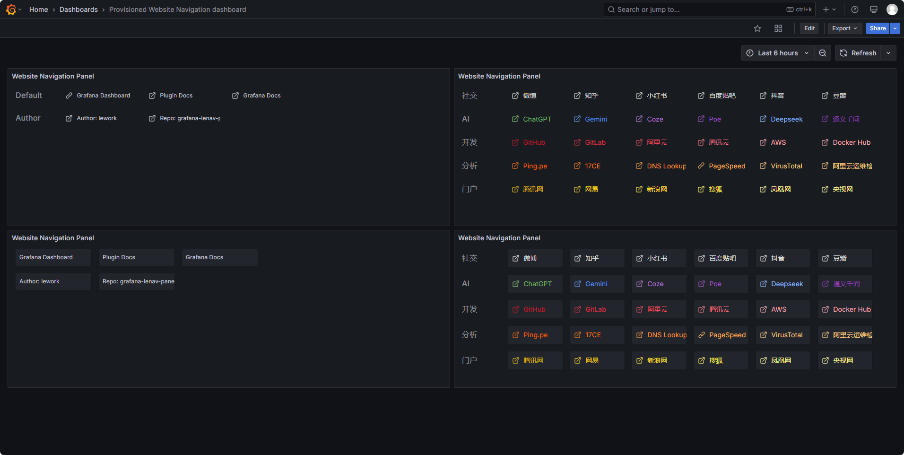
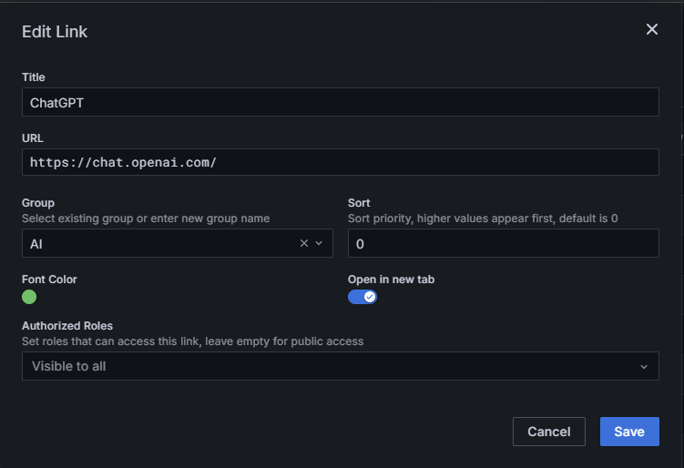

# Grafana 网站导航面板插件

[](https://github.com/lework/grafana-lenav-panel)
[](LICENSE)
[](https://grafana.com)

一个功能强大且灵活的 Grafana 面板插件，用于显示网站导航链接，具有国际化、基于角色的访问控制和可定制主题等高级功能。

## ✨ 主要特性

### 🌍 **完整的国际化支持**

- **多语言支持**：支持英语和简体中文
- **智能语言检测**：自动从 Grafana 用户设置或浏览器偏好检测语言
- **完整本地化**：所有 UI 元素、消息和默认内容都已翻译
- **实时切换**：无需页面重新加载即可动态更新语言

### 🔒 **基于角色的访问控制**

- **基于权限的过滤**：根据用户角色（管理员、编辑者、查看者）显示/隐藏链接
- **安全实现**：与 Grafana 的用户上下文集成，提供安全的访问控制
- **灵活配置**：为每个链接设置角色要求，实现精细控制

### 🎨 **高级主题和自定义**

- **多种显示主题**：在默认布局和框式布局之间选择
- **字体大小控制**：可自定义字体大小（8-32px 范围）
- **链接宽度设置**：可调整链接显示宽度
- **图标选项**：开启/关闭链接图标显示

### 📋 **智能链接管理**

- **分组系统**：将链接组织成逻辑分类
- **自定义排序**：使用可配置的排序值对分组和链接进行排序
- **链接编辑器**：用户友好的导航数据管理界面
- **目标控制**：在同一窗口或新标签页中打开链接

## 🚀 快速开始

### 安装

1. **下载插件**

   ```bash
   # 方式 1：从 Grafana 插件目录
   grafana-cli plugins install lework-lenav-panel

   # 方式 2：手动安装
   git clone https://github.com/lework/grafana-lenav-panel.git
   cd grafana-lenav-panel
   npm install && npm run build
   ```

2. **复制到 Grafana 插件目录**

   ```bash
   cp -r dist/ /var/lib/grafana/plugins/lework-lenav-panel/
   ```

3. **重启 Grafana**
   ```bash
   systemctl restart grafana-server
   ```

### 基本用法

1. **添加面板**

   - 创建新的仪表板或编辑现有仪表板
   - 添加新面板并选择"Website Navigation"作为可视化类型

2. **配置导航数据**

   - 点击面板设置
   - 导航到"Navigation Data"部分
   - 添加链接并将它们组织成分组

3. **自定义外观**
   - 选择偏好的主题（默认或框式）
   - 配置显示选项（字体大小、链接宽度、图标）
   - 设置分组名称可见性偏好

## 📖 配置指南

### 导航数据结构

使用以下 JSON 结构配置导航链接：

```json
[
  {
    "group": "开发",
    "title": "GitHub 仓库",
    "url": "https://github.com/lework/grafana-lenav-panel",
    "targetBlank": true,
    "sort": 100,
    "roles": ["Admin", "Editor"]
  },
  {
    "group": "文档",
    "title": "Grafana 文档",
    "url": "https://grafana.com/docs/",
    "targetBlank": true,
    "sort": 90,
    "roles": ["Admin", "Editor", "Viewer"]
  }
]
```

### 字段说明

| 字段          | 类型    | 必需 | 描述                                       |
| ------------- | ------- | ---- | ------------------------------------------ |
| `group`       | string  | 是   | 用于分组链接的分类名称                     |
| `title`       | string  | 是   | 链接的显示名称                             |
| `url`         | string  | 是   | 目标 URL（支持 Grafana 变量）              |
| `targetBlank` | boolean | 否   | 在新标签页中打开（默认：false）            |
| `sort`        | number  | 否   | 排序优先级（数值越高排在前面）             |
| `roles`       | array   | 否   | 所需用户角色 ["Admin", "Editor", "Viewer"] |

### 面板选项

#### 显示设置

- **主题**：在默认或框式样式之间选择
- **显示分组名称**：切换分类标题
- **显示链接图标**：显示导航图标
- **字体大小**：调整文本大小（8-32px）
- **链接宽度**：设置链接按钮宽度

#### 访问控制

- 为每个链接配置基于角色的权限
- 没有所需权限的用户将自动隐藏链接
- 支持 Grafana 的内置角色系统

## 🌍 语言支持

插件支持多种语言并具有自动检测功能：

### 支持的语言

- **English** (en) - 默认
- **简体中文** (zh) - 简体中文

### 语言检测优先级

1. Grafana 用户语言设置
2. 浏览器语言偏好
3. 回退到英语

### 本地化内容

- 面板配置选项
- 链接编辑界面
- 错误消息和通知
- 默认导航链接
- 无障碍标签

## 🛠️ 技术规格

### 系统要求

- **Grafana**：10.4.0 或更高版本
- **Node.js**：18 或更高版本（用于开发）
- **浏览器**：支持 ES6+ 的现代浏览器

### 技术栈

- **前端**：React 18.2.0 与 TypeScript
- **样式**：Emotion CSS-in-JS
- **国际化**：react-i18next
- **构建系统**：Webpack 5
- **测试**：Jest + Playwright

### 性能

- 轻量级包大小（~50KB gzipped）
- 使用 React hooks 的高效重渲染
- 针对多面板仪表板优化

## 🔧 开发

### 本地开发环境设置

```bash
# 克隆仓库
git clone https://github.com/lework/grafana-lenav-panel.git
cd grafana-lenav-panel

# 安装依赖
npm install

# 启动开发服务器
npm run dev

# 使用 Docker 运行（包含 Grafana 实例）
npm run server
```

### 构建命令

```bash
# 开发构建，带观察模式
npm run dev

# 生产构建
npm run build

# 运行测试
npm run test

# 运行 E2E 测试
npm run e2e

# 代码检查和格式化
npm run lint:fix
```

### 测试

```bash
# 单元测试
npm run test:ci

# E2E 测试（需要 Docker）
npm run server  # 启动 Grafana 实例
npm run e2e     # 运行 Playwright 测试
```

## 📸 截图

### 默认主题



### 配置面板




## 🤝 贡献

我们欢迎贡献！

### 开发工作流程

1. Fork 仓库
2. 创建功能分支：`git checkout -b feature/amazing-feature`
3. 进行更改并添加测试
4. 确保所有测试通过：`npm run test:ci`
5. 提交 pull request

### 报告问题

- 使用 GitHub Issues 报告错误和功能请求
- 提供详细的重现步骤
- 包含 Grafana 版本和浏览器信息

## 📄 许可证

本项目采用 Apache License 2.0 许可证 - 详情请参见 [LICENSE](LICENSE) 文件。

## 👨‍💻 作者与支持

**创作者**：[Lework](https://lework.github.io/)

### 获取帮助

- 📧 **邮箱**：lework@yeah.net
- 🐛 **问题**：[GitHub Issues](https://github.com/lework/grafana-lenav-panel/issues)
- 📖 **文档**：[项目 Wiki](https://github.com/lework/grafana-lenav-panel/wiki)

### 社区

- ⭐ 如果您觉得有用，请给仓库加星
- 🍴 Fork 并为项目做贡献
- 📢 分享您的使用案例和反馈

---

<p align="center">
  <strong>用 ❤️ 为 Grafana 社区制作</strong>
</p>

<p align="center">
  <a href="https://github.com/lework/grafana-lenav-panel">
    
  </a>
  <a href="https://github.com/lework/grafana-lenav-panel/fork">
    
  </a>
</p>
