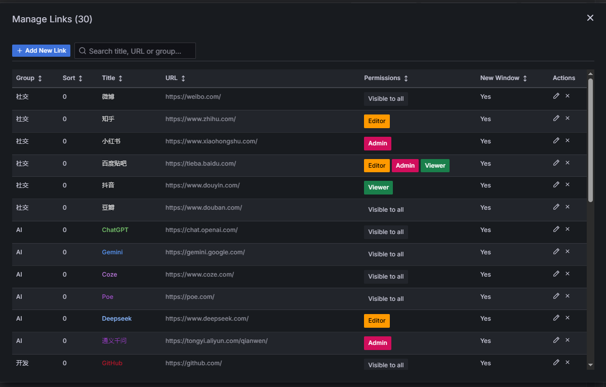

# Website Navigation Panel for Grafana

[](https://github.com/lework/grafana-lenav-panel)
[](LICENSE)
[](https://grafana.com)

A powerful and flexible Grafana panel plugin for displaying website navigation links with advanced features including internationalization, role-based access control, and customizable themes.

## ✨ Key Features

### 🌍 **Full Internationalization Support**

- **Multi-language Support**: English and Simplified Chinese
- **Smart Language Detection**: Automatically detects from Grafana user settings or browser preferences
- **Complete Localization**: All UI elements, messages, and default content are translated
- **Real-time Switching**: Dynamic language updates without page reload

### 🔒 **Role-Based Access Control**

- **Permission-based Filtering**: Show/hide links based on user roles (Admin, Editor, Viewer)
- **Secure Implementation**: Integrates with Grafana's user context for secure access control
- **Flexible Configuration**: Set role requirements per link for granular control

### 🎨 **Advanced Theming & Customization**

- **Multiple Display Themes**: Choose between default and box-style layouts
- **Font Size Control**: Customizable font size (8-32px range)
- **Link Width Settings**: Adjustable link display width
- **Icon Options**: Toggle link icons on/off

### 📋 **Smart Link Management**

- **Grouping System**: Organize links into logical categories
- **Custom Sorting**: Sort both groups and links with configurable sort values
- **Link Editor**: Intuitive interface for managing navigation data
- **Target Control**: Open links in same window or new tab

## 🚀 Quick Start

### Installation

1. **Download the plugin**

   ```bash
   # Option 1: From Grafana Plugin Directory
   grafana-cli plugins install lework-lenav-panel

   # Option 2: Manual installation
   git clone https://github.com/lework/grafana-lenav-panel.git
   cd grafana-lenav-panel
   npm install && npm run build
   ```

2. **Copy to Grafana plugins directory**

   ```bash
   cp -r dist/ /var/lib/grafana/plugins/lework-lenav-panel/
   ```

3. **Restart Grafana**
   ```bash
   systemctl restart grafana-server
   ```

### Basic Usage

1. **Add the Panel**

   - Create a new dashboard or edit an existing one
   - Add a new panel and select "Website Navigation" as the visualization type

2. **Configure Navigation Data**

   - Click on panel settings
   - Navigate to the "Navigation Data" section
   - Add your links and organize them into groups

3. **Customize Appearance**
   - Choose your preferred theme (Default or Box)
   - Configure display options (font size, link width, icons)
   - Set group name visibility preferences

## 📖 Configuration Guide

### Navigation Data Structure

Configure your navigation links using this JSON structure:

```json
[
  {
    "group": "Development",
    "title": "GitHub Repository",
    "url": "https://github.com/lework/grafana-lenav-panel",
    "targetBlank": true,
    "sort": 100,
    "roles": ["Admin", "Editor"]
  },
  {
    "group": "Documentation",
    "title": "Grafana Docs",
    "url": "https://grafana.com/docs/",
    "targetBlank": true,
    "sort": 90,
    "roles": ["Admin", "Editor", "Viewer"]
  }
]
```

### Field Descriptions

| Field         | Type    | Required | Description                                       |
| ------------- | ------- | -------- | ------------------------------------------------- |
| `group`       | string  | Yes      | Category name for grouping links                  |
| `title`       | string  | Yes      | Display name for the link                         |
| `url`         | string  | Yes      | Target URL (supports Grafana variables)           |
| `targetBlank` | boolean | No       | Open in new tab (default: false)                  |
| `sort`        | number  | No       | Sorting priority (higher values appear first)     |
| `roles`       | array   | No       | Required user roles ["Admin", "Editor", "Viewer"] |

### Panel Options

#### Display Settings

- **Theme**: Choose between Default or Box style
- **Show Group Names**: Toggle category headers
- **Show Link Icons**: Display navigation icons
- **Font Size**: Adjust text size (8-32px)
- **Link Width**: Set link button width

#### Access Control

- Configure role-based permissions for each link
- Links automatically hide for users without required permissions
- Supports Grafana's built-in role system

## 🌍 Language Support

The plugin supports multiple languages with automatic detection:

### Supported Languages

- **English** (en) - Default
- **简体中文** (zh) - Simplified Chinese

### Language Detection Priority

1. Grafana user language settings
2. Browser language preferences
3. Falls back to English

### Localized Content

- Panel configuration options
- Link editor interface
- Error messages and notifications
- Default navigation links
- Accessibility labels

## 🛠️ Technical Specifications

### Requirements

- **Grafana**: Version 10.4.0 or higher
- **Node.js**: Version 18 or higher (for development)
- **Browser**: Modern browsers with ES6+ support

### Technology Stack

- **Frontend**: React 18.2.0 with TypeScript
- **Styling**: Emotion CSS-in-JS
- **Internationalization**: react-i18next
- **Build System**: Webpack 5
- **Testing**: Jest + Playwright

### Performance

- Lightweight bundle size (~50KB gzipped)
- Efficient re-rendering with React hooks
- Optimized for dashboards with multiple panels

## 🔧 Development

### Local Development Setup

```bash
# Clone the repository
git clone https://github.com/lework/grafana-lenav-panel.git
cd grafana-lenav-panel

# Install dependencies
npm install

# Start development server
npm run dev

# Run with Docker (includes Grafana instance)
npm run server
```

### Build Commands

```bash
# Development build with watch mode
npm run dev

# Production build
npm run build

# Run tests
npm run test

# Run E2E tests
npm run e2e

# Lint and format code
npm run lint:fix
```

### Testing

```bash
# Unit tests
npm run test:ci

# E2E tests (requires Docker)
npm run server  # Start Grafana instance
npm run e2e     # Run Playwright tests
```

## 📸 Screenshots

### Default Theme


### Configuration Panel




## 🤝 Contributing

We welcome contributions!

### Development Workflow

1. Fork the repository
2. Create a feature branch: `git checkout -b feature/amazing-feature`
3. Make your changes and add tests
4. Ensure all tests pass: `npm run test:ci`
5. Submit a pull request

### Reporting Issues

- Use GitHub Issues for bug reports and feature requests
- Provide detailed reproduction steps
- Include Grafana version and browser information

## 📄 License

This project is licensed under the Apache License 2.0 - see the [LICENSE](LICENSE) file for details.

## 👨‍💻 Author & Support

**Created by**: [Lework](https://lework.github.io/)

### Get Help

- 📧 **Email**: lework@yeah.net
- 🐛 **Issues**: [GitHub Issues](https://github.com/lework/grafana-lenav-panel/issues)
- 📖 **Documentation**: [Project Wiki](https://github.com/lework/grafana-lenav-panel/wiki)

### Community

- ⭐ Star this repository if you find it useful
- 🍴 Fork and contribute to the project
- 📢 Share your use cases and feedback

---

<p align="center">
  <strong>Made with ❤️ for the Grafana community</strong>
</p>

<p align="center">
  <a href="https://github.com/lework/grafana-lenav-panel">
    
  </a>
  <a href="https://github.com/lework/grafana-lenav-panel/fork">
    
  </a>
</p>
